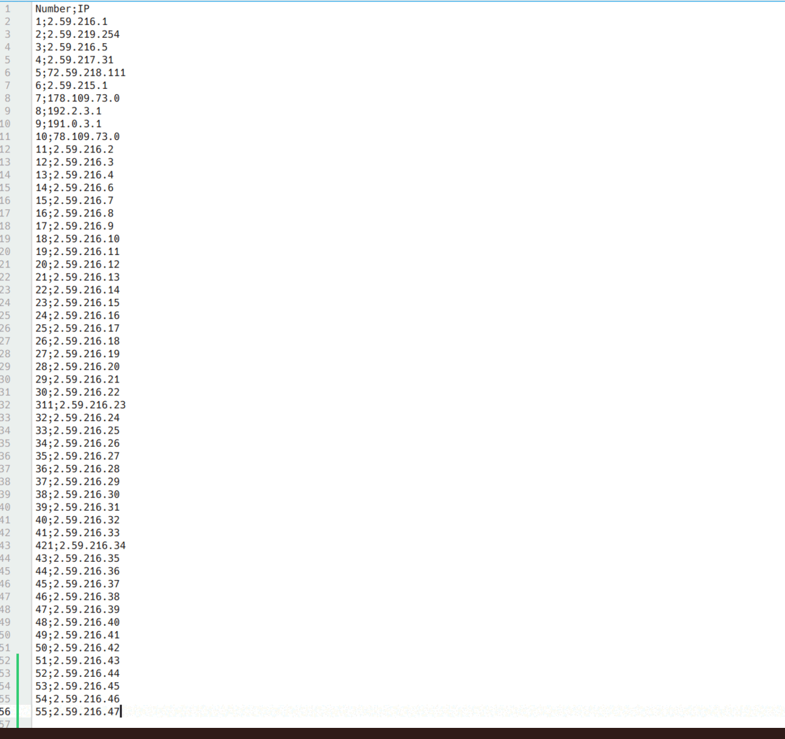

# Скрипт для проверки списка IP-адресов

Предназначен для определения принадлежности списка IP-адресов к сети по указанной маске и провайдера.

### Особенности реализации:
+ Для своей работы скрипт запрашивает следующие аргументы:
    - IPv4 адрес сети;
    - Маску подсети;
    - Список проверяемых IP-адресов:
      * Строкой через разделитель;
      * Передачей пути до CSV файла. В данном файле ip-адреса должны находиться в колонке с именем `IP`.
+ В зависимости от способа передачи списка IP-адресов, скрипт либо выводит результат на экран, либо формирует новый 
CSV-файл с результатами его работы;
+ Некоторые параметры для работы с API сервиса определения провайдера и CSV файлами задаются как переменные окружения. 

### Комментарии по запуску:
**Необходимо выполнить следующие действия:**
+ Создать файл `.env` на основании шаблона `.env.template`, указав в нём необходимые значения переменных окружения;
+ После запуска, скрипт предложит ввести IPv4 адрес сети, маску сети и передать список проверяемых IP-адресов;
+ Список может быть передан как строка, содержащая адреса через разделитель, либо как пусть к CSV файлу;
+ Если в переданной строке будет найдено хотя бы одно соответствие шаблону IPv4 адреса, строка будет определена как 
список адресов, иначе как пусть к CSV файлу;
+ CSV файл обязательно должен содержать столбец с именем `ID` в котором должны быть представлены IPv4 адреса. 
При несоответствии формата, файл обработан не будет;

>В качестве тестовых данных вы можете использовать файл `test_file.csv` из директории `examples`, адрес сети 
`2.59.216.0` и маску `255.255.252.0` или эти же маску и адрес и тестовую следующую строку данных для 
передачи в консоль: `Some 2.59.216.1, string 2.59.219.254, with 2.59.216.5, a 2.59.217.31, list 72.59.218.111, 
> of 2.59.215.1, IP 178.109.73.0, addresses 192.2.3.1, 191.0.3.1, 78.109.73.0`

# Script for checking the list of IP addresses

Determines whether a list of IP addresses belongs to the network by the specified mask and receiving the provider name.

### Some features:
+ You need to provide the following arguments:
    - IPv4 address of the network;
    - Subnet mask;
    - List of IP addresses:
      * As a string separated by a delimiter;
      * By passing the path to the CSV file. In this file the ip-addresses must be in the column named `IP`.
+ Depending on how you send the list of IP addresses, the script either displays the result in console 
or generates a new CSV file with the results;
+ Some API and CSV parameters are set via environment variables.

### Getting Started:
**Please follow these steps:**
+ Create `.env` file based on the template `.env.template` and specify the necessary variables in it;
+ After launching, the script asks you to enter the IPv4 network address, netmask and pass the list of IP addresses 
to be checked;
+ The list can be passed as a string with addresses separated by a delimiter, or as a CSV file;
+ If at least one matching IPv4 address pattern is found, the string will be defined as 
a list of addresses, otherwise as a CSV file;
+ The CSV file must contain a column named `ID` in which IPv4 addresses must be represented. 
If the format does not match, the file will not be processed;

>As a test data you can use file `test_file.csv` from `examples` directory, `2.59.216.0` as a network address 
`255.255.252.0` as a netmask. Or the same mask and address and the following test data string:
to be passed to the console: `Some 2.59.216.1, string 2.59.219.254, with 2.59.216.5, a 2.59.217.31, list 72.59.218.111, 
> of 2.59.215.1, IP 178.109.73.0, addresses 192.2.3.1, 191.0.3.1, 78.109.73.0`

